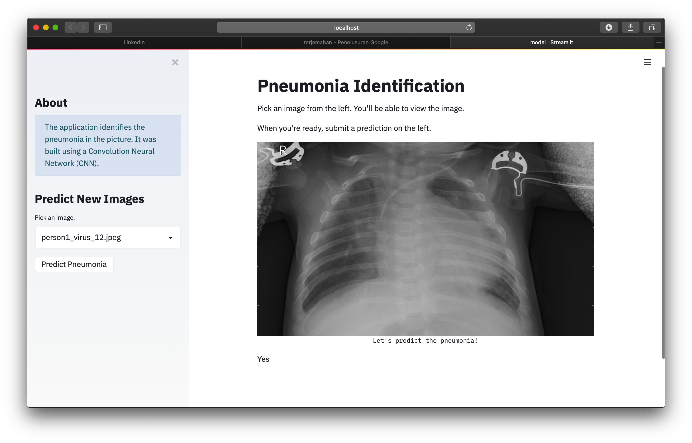

# PneumoniaIdentificationApp
I have just completed the application of detecting pneumonia through X-ray images by implementing a deep learning approach. I tried to build a CNN model with hard and tensorflow. And create an interface that is used as a medium that users can use to use applications. For the interface I use Streamlit.

## Screenshot

